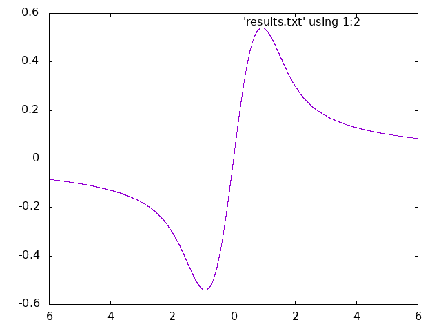

# GNU Scientifc Library 
Example of how to compile GNU Scientific Library code.  Evaluates Dawson's integral over a range of x values.

Compile with 

```
g++ -std=c++11 dawson.cpp -o ./dawson -lgsl -lgslcblas -lm
```

Run with 

```
./dawson > results.txt
```

Generate the plot 

```
gnuplot plot.gpl
```


